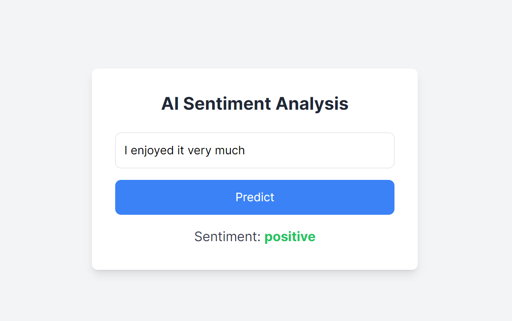
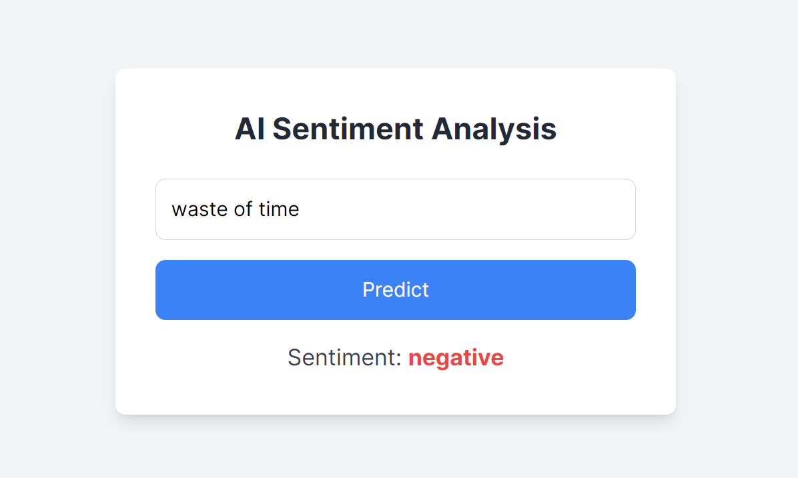

Sentiment Analysis on Movie Reviews

Overview
This project implements a sentiment analysis tool to classify movie reviews as either positive or negative. It uses a Naive Bayes classifier with TF-IDF vectorization for text data processing. The solution includes a Flask API backend and a React frontend styled with Tailwind CSS.

Project Structure
api/: Contains the Flask API for sentiment prediction.
app.py: Flask application with an endpoint for sentiment prediction.
ml/: Contains scripts for training the sentiment analysis model.
train_model.py: Script to train and save the machine learning model.
frontend/: Contains the React application for the user interface.
pages/: React pages including the main prediction interface.
Features
Backend:
Flask API serving the trained sentiment analysis model.
Predicts sentiment based on user input.
Frontend:
React application with Tailwind CSS for a clean and responsive UI.
Allows users to input movie reviews and view sentiment predictions.
Setup Instructions
Backend (Flask API)
Install Dependencies:

bash
Copy code
pip install flask flask-cors scikit-learn pandas numpy
Run the Flask API:

bash
Copy code
python api/app.py
The API will be available at http://localhost:5000.

Frontend (React)
Install Dependencies:

bash
Copy code
npm install
Start the React Application:

bash
Copy code
npm run dev
The application will be available at http://localhost:3000.

Training the Model
Prepare the Dataset: Place your CSV file with movie reviews in the ml/ directory.

Train the Model:

bash
Copy code
python ml/train_model.py
This script will generate a model.pkl file in the ml/ directory.

Basic Glimpse :-

Usage
Enter a Movie Review: Use the React frontend to input a movie review.
Get Sentiment Prediction: Click the "Predict" button to receive the sentiment analysis result from the Flask API.
Contributing
Contributions are welcome! To contribute:

Fork the repository.
Create a new branch (git checkout -b feature/YourFeature).
Commit your changes (git commit -am 'Add new feature').
Push to the branch (git push origin feature/YourFeature).
Create a new Pull Request.
License
This project is licensed under the MIT License. See the LICENSE file for more details.

Acknowledgements
Scikit-learn: For machine learning tools.
Flask: For the web framework.
React: For the frontend framework.
Tailwind CSS: For styling.
